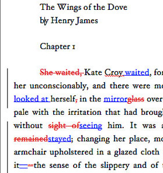

## Your experience

Do you use Tracking of changes in Microsoft Word or Revision history in Google Drive?

## Why version control for R users?

* Track of your work
* Separate branch for every standalone task (fix or improvement)
* Collaboration

## Git

_noun_ [ˈgit]

_British Slang_. A stupid or worthless person (especially a man)

~[Merriam-Webster, Incorporated](http://www.merriam-webster.com/dictionary/git)~

## Git software

Developer: Linus Torvalds (creator of Linux kernel) 

Target: Linux kernel

Aims: 

* to control files' revisions (12,020,528 lines spread over 36,595 unique files); 
* to support collaboration (12,000 programmers);
* with stress on branches and resolution of conflicts.