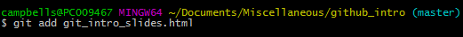

## Your experience: tracking of changes

Do you use Tracking of changes in Microsoft Word or Revision history in Google Drive?

## MS Word approach of tracking

* Automatic
* What, but not why
* Distributed (no central server is required)

## Your experience: collaboration

* Copies of files by email
* Shared drive (T:, Dropbox)
* Google Documents; MS Office 365

## Why version control for R users?

* Track of your work
* Separate branch for every standalone task (fix or improvement)
* Collaboration

There are many programms for version control (e.g. Subversion), but we vote for __Git__!

## Git

_noun_ [ˈgit]

_British Slang_. A stupid or worthless person (especially a man)

## Git software

Developer: Linus Torvalds (a Finnish gentleman and creator of Linux kernel) 

Target: Linux kernel

Aims: 

* to control files' revisions (12,020,528 lines spread over 36,595 unique files); 
* to support collaboration (12,000 programmers);
* with stress on easiness of work with branches and
* absence of central server (_distributed_ version control system).

Type: Free open source software

## GitHub

* "Web-addon" for git

* Commercial webservice with free public accounts

* "Social network" for coders

* User-friendly interface

* Easy for newbies

* Popular among R-developers

## In Word era people forgot about plain text format

* Software independent
* Light (just copy & paste in Slack, email or IM)
* Friendly
    * Human
    * Machine

## Git clone

* In order to make a copy of an existing repo, you must clone it.
* This is not easy in RStudio directly, so you'll have to command line.
* `git clone https://github.com/octocat/Spoon-Knife.git`

## Git add

* When files are changed, they must be added to the staging area
  * This is an area to collect your files before committing
  

## Git commit

* Committing is like taking a snapshot. You can always go back to an old commit.
* Commits should be accompanied by an informative message

## Git push

* Code ready for the public? Time to push

## Git pull

* Other people made changes? git pull.

##Advanced topics
* Branching
* Rebasing
* Cherry-picking
* Submodules

